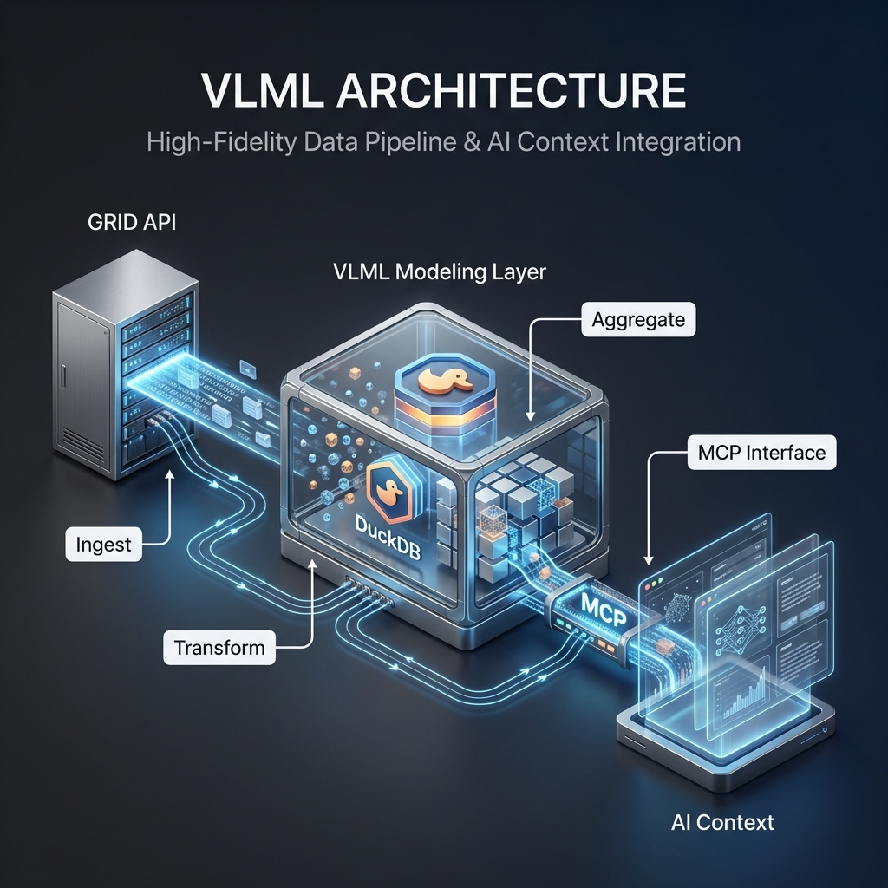

# VLML Architecture

## System Overview

Modeling layer → MCP tools → LLM layer



- **Modeling layer (Product)**: DuckDB tables built from raw GRID JSON.
- **MCP tools (Bridge)**: Data-only endpoints like `match_analysis_report` and `query_sql`.
- **LLM layer (Insights)**: Claude/Gemini converts metrics into coaching narratives.

## Core Philosophy

**We're not building a prediction engine. We're building a context engine.**

The LLM is the reasoning layer. Our job is to give it:
1. Rich, structured situation data
2. Historical benchmarks as reference
3. Enough context to explain its reasoning

This is more powerful than lookup tables because the LLM can:
- Consider multiple factors simultaneously
- Explain its reasoning
- Handle novel situations
- Generate coaching-appropriate language

## Layer Responsibilities

### Layer 1: Data Model (Product)

**Purpose:** Convert raw GRID JSON into a consistent OLAP model for analytics.

**Technology:**
- DuckDB (local / columnar queries)
- GRID JSON exports (raw source data)

**Key tables:**
`series`, `games`, `rounds`, `base_events`, `agg_player_round_stats`,
`agg_player_game_stats`, `agg_team_round_stats`, `agg_team_game_stats`

**Design decisions:**
- Pre-aggregated tables for fast queries
- Numerator/denominator columns for rates (no precomputed %)
- Timing preserved for tempo analysis
- Boolean flags for filtering (`is_clutch`, `is_opening_death`, etc.)

### Layer 2: MCP Tools (Bridge)

**Purpose:** Structured data delivery for LLM consumption.

**Design principles:**
1. Data only (no insights in MCP output)
2. Numerator/denominator format for rates
3. Consistent schemas for LLM parsing
4. Rich context for LLM reasoning (v3.0+)

**Tools:**
- `query_sql`
- `match_analysis_report` (v3.0 - with coaching context)
- `player_profile_report`
- `scouting_report`
- `pattern_detection_report`
- `get_database_info`

**Match Analysis Report v3.0 (Enhanced Coaching Context):**

The v3.0 report includes four new context sections that enable LLM reasoning:

| Section | Purpose | LLM Use Case |
|---------|---------|--------------|
| `economy_context` | Round-by-round economy with LAG | Detect economy cascades ("lost pistol → forced → lost") |
| `round_situations` | Rich per-round state (weapons, util, scores) | "What if" reasoning ("save was better because...") |
| `attack_patterns` | Execute timing, site selection | Detect predictability ("7/12 late executes to A") |
| `benchmarks` | Historical baseline rates | Reference probabilities ("1v2 clutch = 11% baseline") |

**Example economy_context entry:**
```json
{
  "round_number": 3,
  "buy_type": "force",
  "loadout_value": 16100,
  "round_won": false,
  "prev_round": {
    "round_number": 2,
    "buy_type": "eco",
    "round_won": false
  },
  "streak": -2,
  "opponent": {
    "loadout_value": 21450,
    "buy_type": "full_buy"
  }
}
```

**Example benchmarks:**
```json
{
  "clutch_rates": {
    "1v1": {"attempts": 135, "wins": 69, "rate": 51.1},
    "1v2": {"attempts": 98, "wins": 11, "rate": 11.2}
  },
  "sample_size": {
    "total_rounds": 5530,
    "total_games": 267
  }
}
```

### Layer 3: LLM Layer (Insight Generator)

**Purpose:** Convert structured metrics into coaching insights.

**Supported LLMs:**
- Claude (Desktop/API)
- Gemini CLI

**LLM responsibilities:**
1. Interpret metrics
2. Identify patterns
3. Generate recommendations
4. Prioritize VOD review

## Data Flow

1. User request comes in.
2. LLM selects MCP tools.
3. MCP returns structured JSON metrics.
4. LLM generates insights and recommendations.
